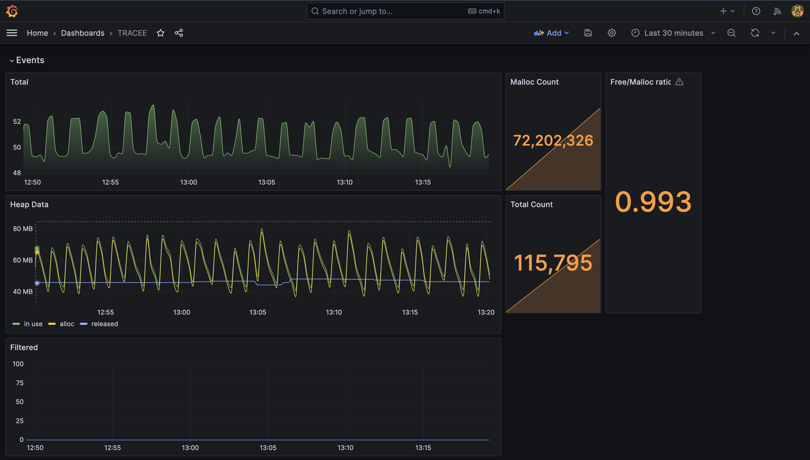

# Access Tracker Metrics in Prometheus and Grafana

Tracker exposes a metrics endpoint. 
This makes it possible to monitor Tracker like other cloud native workloads.

In this tutorial, we will showcase how to access Tracker metrics through Prometheus and Grafana running through docker containers.
The tutorial can easily adapted to Kubernetes workloads with the configuration provided.

## Tutorial Overview

Grafana is a visualization tools for exported metrics and logs, most commonly
used alongside Prometheus.

Since version 0.7.0, tracker exports useful runtime metrics to Prometheus.

By using Grafana and the new metrics from tracker, we can deploy a simple
dashboard which tracks the tracker instance performance and outputs.

There are two options for accessing Tracker metrics:

* Running the Tracker Docker Container Image -- Shown in this tutorial
* Running the Tracker Helm Chart -- Detailed as part of the [Promtail-Tracker](./promtail.md) tutorial



## Tracker Docker Container Image

These metrics exports are enabled by default in all docker images and can be
enabled using the `--metrics` flag.

[tracker]: https://github.com/khulnasoft-lab/tracker/tree/{{ git.tag }}/cmd/tracker

### Prerequisites

The following tools must be available for use, they can all be installed either
through docker or installed/built on your machine. Note that you need to be on a Linux machine to follow the Docker tutorial.
Alternative, on a MacBook it is possible to use Vagrant with Parallels as detailed in the following tutorial:
[Running Tracker on Mac with Parallels and Vagrant](./tracker-vagrant.md)

- [Tracker](https://github.com/khulnasoft-lab/tracker/)
- [Prometheus](https://prometheus.io/download/)
- [Grafana](https://grafana.com/docs/grafana/latest/getting-started/getting-started)

### Run Tracker with Metrics Enabled -- The Docker Command

Tracker can be most easily deployed with metrics enabled by default and port
forwarded through the following commands:

```shell
docker run --name tracker -it --rm \
  --pid=host --cgroupns=host --privileged \
  -v /etc/os-release:/etc/os-release-host:ro \
  -v /var/run:/var/run:ro \
  -p 3366:3366 \
  khulnasoft/tracker:latest \
  --metrics 
```

Of course, the forwarded metrics ports can be changed, but you should note that
some of the later instructions depend on these ports.

If running Tracker locally through built binaries, the metrics address may be
overrides with the `--listen-addr` flag.

### Run Prometheus and Configure it to Scrape Tracker

Install Prometheus or pull it's Docker image. Then create the following
configuration file, call it `prometheus.yml` to scrape Tracker:

```yaml
# A scrape configuration containing exactly one endpoint to scrape:
# Here it's Tracker.
scrape_configs:
  # The job name is added as a label `job=<job_name>` to any timeseries scraped from this config.
  - job_name: 'tracker'

    # Override the global default and scrape targets from this job every 5 seconds.
    scrape_interval: 5s
    metrics_path: /metrics

    #Scrape tracker's default metrics hosts.
    #If forwarding different ports make sure to change these addresses.
    static_configs:
      - targets: ['localhost:3366']
```

Note that the localhost:3366 might have to be replaced with your IP address. The IP address can be found with the following command:
```
/sbin/ifconfig
```

We can then start Prometheus with the following command:

```console
prometheus --config.file=/path/to/prometheus.yml
```

Or alternatively with docker:

```console
docker run \
    -p 9090:9090 \
    -v ./prometheus.yml:/etc/prometheus/prometheus.yml \
    prom/prometheus
```

Ensure that prometheus can scrape the Tracker target: Open the Prometheus UI at `http://localhost:9090`
Under Status < Targets will be the scrape targets listed.

If successful, move to the next step, otherwise consult with the Prometheus documentation.

## Run Grafana to display Tracker's Prometheus Metrics

After successfully deploying Tracker and Prometheus we may now run Grafana to
visualize it's metrics.

Install Grafana using the Grafana container image:

```console
docker run -d -p 3000:3000 --name=grafana grafana/grafana-enterprise
```

Next, you should be able to access the Grafana UI throug: `http://localhost:3000`.

After entering the website, logging in with username and password `admin` (and
changing your password if you wish), you should see the homepage:


Add your data source by hovering the configuration tab (the gear icon),
selecting "Data Sources" and pressing "Add Data Source" at the top left. Create
a Prometheus Data Source and point it's URL to the relevant location (usually
http://localhost:9090)

Note that you might have to use your local IP address again instead of `localhost`.

You may now either create your own Dashboard or import our default dashboard.

### Import Tracker's Default Dashboard

First download our Grafana Dashboard's json [here].

[here]: https://github.com/khulnasoft-lab/tracker/tree/main/deploy/grafana/tracker.json

After adding the data source hover on the plus icon in the sidebar and select
"Import". Press "Upload JSON File" at the top of the page and select the
downloaded json from your file browser. Change the name and Dashboard UID if
you wish and press "Import" to finish. 

Finally you will be redirected to the dashboard 🥳
